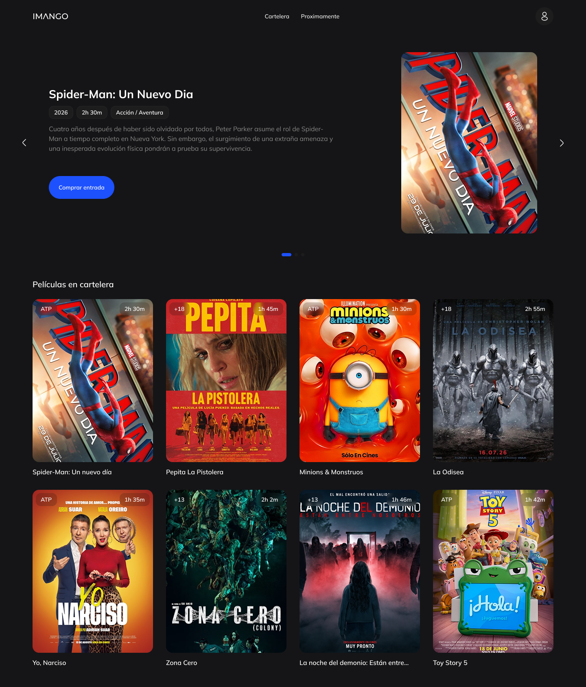
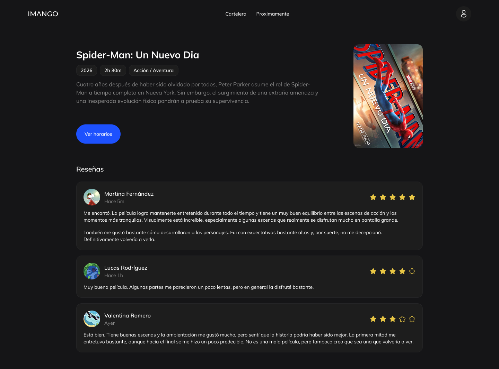

# Imango Cine

Aplicación web para la gestión y venta de entradas de un cine multisala: catálogo de películas y funciones, selección de butacas en tiempo real, compra de candy bar, sistema de fidelización, cupones, preventa y panel de administración con reportes.

## Diagrama de base de datos

```mermaid
erDiagram
    users {
        uuid id PK
        text email
        text first_name
        text last_name
        date birth_date
        text blood_type
        text eye_color
        smallint vacation_days
        text avatar
        user_role role
        timestamptz created_at
    }

    MOVIES {
        uuid id PK
        text title
        text slug UK
        text synopsis
        text poster
        int duration
        smallint age_restriction
        date released
        boolean is_active
        boolean presale_enabled
        smallint presale_days
        numeric presale_price
        timestamptz created_at
    }

    GENRES {
        uuid id PK
        text name UK
    }

    MOVIE_GENRES {
        uuid movie_id PK,FK
        uuid genre_id PK,FK
    }

    ROOMS {
        uuid id PK
        text name UK
        boolean is_active
    }

    SHOWTIMES {
        uuid id PK
        uuid movie_id FK
        uuid room_id FK
        timestamptz starts_at
        timestamptz ends_at
        timestamptz blocked_until
        showtime_format format
        showtime_language language
        numeric price
        boolean is_active
        uuid created_by FK
        timestamptz created_at
    }

    PRODUCT_CATEGORIES {
        uuid id PK
        text name UK
    }

    PRODUCTS {
        uuid id PK
        uuid category_id FK
        text name
        text description
        text image_url
        numeric price
        boolean is_available
        timestamptz created_at
    }

    COMBOS {
        uuid id PK
        text name
        text description
        text image_url
        combo_type type
        numeric price
        boolean includes_ticket
        boolean is_featured
        boolean is_available
        timestamptz created_at
    }

    COMBO_ITEMS {
        uuid combo_id PK,FK
        uuid product_id PK,FK
        smallint quantity
    }

    COUPONS {
        uuid id PK
        text name
        coupon_kind kind
        text code UK
        numeric discount_percent
        smallint older_than_age
        boolean is_active
        timestamptz starts_at
        timestamptz ends_at
    }

    COUPON_REDEMPTIONS {
        uuid id PK
        uuid coupon_id FK
        uuid user_id FK
        uuid order_id FK,UK
        timestamptz created_at
    }

    ORDERS {
        uuid id PK
        text code UK
        uuid user_id FK
        text guest_email
        uuid showtime_id FK
        uuid coupon_id FK
        numeric subtotal
        numeric discount_amount
        numeric credit_used
        numeric total
        text payment_method
        text payment_reference
        order_status status
        timestamptz tickets_validated_at
        uuid tickets_validated_by FK
        timestamptz candy_delivered_at
        uuid candy_delivered_by FK
        timestamptz cancelled_at
        timestamptz created_at
    }

    TICKETS {
        uuid id PK
        uuid order_id FK
        uuid showtime_id FK
        text seat_code
        seat_type seat_type
        numeric price
        ticket_status status
    }

    ORDER_ITEMS {
        uuid id PK
        uuid order_id FK
        uuid product_id FK
        uuid combo_id FK
        smallint quantity
        numeric unit_price
    }

    SEAT_HOLDS {
        uuid showtime_id PK,FK
        text seat_code PK
        uuid session_id
        timestamptz expires_at
    }

    REWARDS {
        uuid id PK
        text name
        reward_type type
        uuid product_id FK
        integer points_cost
        boolean is_active
    }

    REWARD_REDEMPTIONS {
        uuid id PK
        uuid user_id FK
        uuid reward_id FK
        integer points_spent
        uuid used_order_id FK
        timestamptz created_at
    }

    LOYALTY_TRANSACTIONS {
        uuid id PK
        uuid user_id FK
        integer points
        loyalty_tx_type type
        uuid order_id FK
        timestamptz created_at
    }

    CREDIT_TRANSACTIONS {
        uuid id PK
        uuid user_id FK
        numeric amount
        credit_tx_type type
        uuid order_id FK
        timestamptz created_at
    }

    REVIEWS {
        uuid id PK
        uuid user_id FK
        uuid movie_id FK
        smallint rating
        text comment
        timestamptz created_at
    }

    MOVIE_ALERTS {
        uuid id PK
        uuid user_id FK
        uuid movie_id FK
        timestamptz notified_at
        timestamptz created_at
    }

    ACTIVITY_LOG {
        uuid id PK
        uuid user_id FK
        text action
        text entity_type
        text entity_id
        jsonb details
        timestamptz created_at
    }

    APP_SETTINGS {
        text key PK
        text value
        text description
        timestamptz updated_at
    }

    MOVIES ||--o{ MOVIE_GENRES : has
    GENRES ||--o{ MOVIE_GENRES : "used in"
    MOVIES ||--o{ SHOWTIMES : "screened as"
    ROOMS ||--o{ SHOWTIMES : hosts
    PROFILES ||--o{ SHOWTIMES : creates

    SHOWTIMES ||--o{ TICKETS : sells
    SHOWTIMES ||--o{ ORDERS : "booked for"
    SHOWTIMES ||--o{ SEAT_HOLDS : "holds seats for"

    PROFILES ||--o{ ORDERS : places
    ORDERS ||--o{ TICKETS : contains
    ORDERS ||--o{ ORDER_ITEMS : contains
    ORDERS ||--o| COUPON_REDEMPTIONS : redeems
    COUPONS ||--o{ ORDERS : "applied to"
    COUPONS ||--o{ COUPON_REDEMPTIONS : "redeemed via"
    PROFILES ||--o{ COUPON_REDEMPTIONS : redeems

    PRODUCT_CATEGORIES ||--o{ PRODUCTS : groups
    PRODUCTS ||--o{ COMBO_ITEMS : "included in"
    COMBOS ||--o{ COMBO_ITEMS : includes
    PRODUCTS ||--o{ ORDER_ITEMS : "bought as"
    COMBOS ||--o{ ORDER_ITEMS : "bought as"
    PRODUCTS ||--o{ REWARDS : "redeemable as"

    PROFILES ||--o{ REWARD_REDEMPTIONS : redeems
    REWARDS ||--o{ REWARD_REDEMPTIONS : "redeemed via"
    ORDERS ||--o| REWARD_REDEMPTIONS : "used in"

    PROFILES ||--o{ LOYALTY_TRANSACTIONS : accrues
    ORDERS ||--o{ LOYALTY_TRANSACTIONS : generates

    PROFILES ||--o{ CREDIT_TRANSACTIONS : accrues
    ORDERS ||--o{ CREDIT_TRANSACTIONS : generates

    PROFILES ||--o{ REVIEWS : writes
    MOVIES ||--o{ REVIEWS : receives

    PROFILES ||--o{ MOVIE_ALERTS : subscribes
    MOVIES ||--o{ MOVIE_ALERTS : "alerted for"

    PROFILES ||--o{ ACTIVITY_LOG : performs
```

## Capturas de pantalla

### Inicio

### Inicio de sesión

### Detalle de la película

